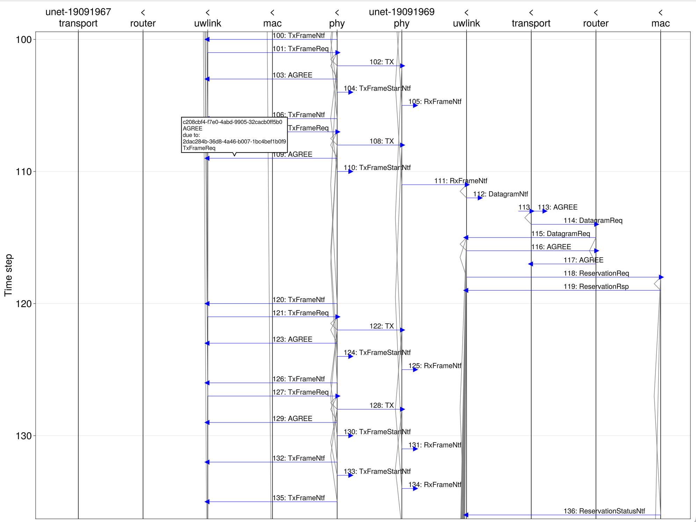

# UnetViz – Unet Trace Visualizer

To install:
```julia
using Pkg
Pkg.add("https://github.com/org-arl/UnetViz.jl")
```

To use:
```julia
using UnetViz
showtrace("trace.json", 1)      # show the first trace in trace.json
```

Sample output:
<br>
